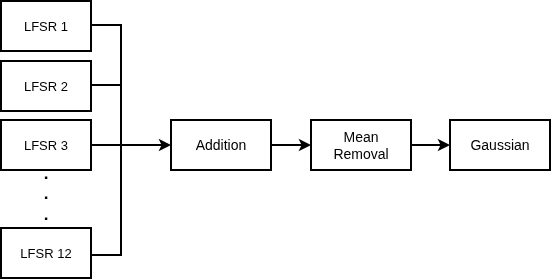
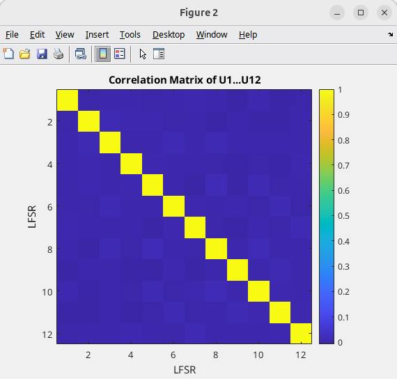
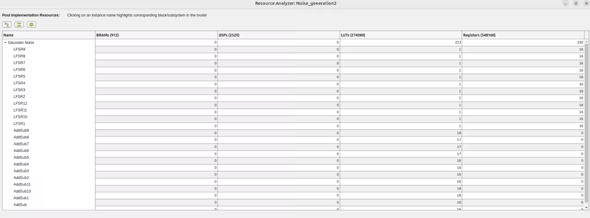
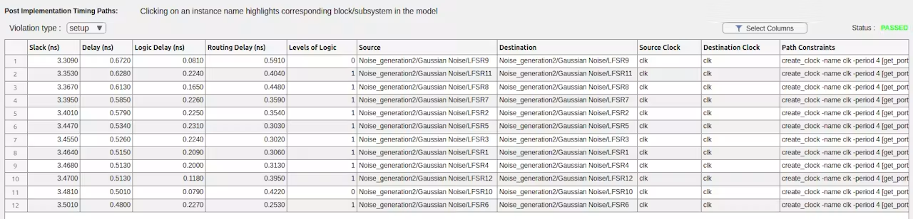

# Gaussian Noise in FPGA using LFSRs and CLT

An FPGA-friendly Gaussian random sequence generator using 12 parallel 16-bit LFSRs and the Central Limit Theorem (CLT).

[](https://www.hackster.io/mehtisham/generating-gaussian-noise-in-fpga-using-lfsrs-and-clt-406607)

## Overview

Gaussian noise is widely used in digital communication, radar, SDR, and electronic test systems for evaluating the behavior of systems under realistic stochastic conditions.

This project explores a hardware-friendly method for generating an approximately Gaussian random sequence directly in FPGA logic.

Instead of using mathematical transformations that require operations such as logarithms, square roots, or trigonometric functions, the design uses:

**LFSRs → Uniform Random Sources → CLT Summation → Gaussian Random Sequence**

The design was developed and validated using **AMD Vitis Model Composer** and **MATLAB**, with the goal of generating a reusable FPGA IP block for integration into **AMD Vivado**.

> **Detailed project walkthrough:**
> https://www.hackster.io/mehtisham/generating-gaussian-noise-in-fpga-using-lfsrs-and-clt-406607

---

## Architecture

The design consists of twelve parallel 16-bit LFSR-based pseudo-random generators.

Each LFSR produces a fixed-point uniform pseudo-random sequence. The twelve outputs are summed and the theoretical mean of the sum is removed to obtain an approximately zero-mean, unit-variance Gaussian sequence.

```text
       LFSR 1 ─────┐
       LFSR 2 ─────┤
       LFSR 3 ─────┤
       LFSR 4 ─────┤
       LFSR 5 ─────┤
       LFSR 6 ─────┤
       LFSR 7 ─────┼──→ Summation ──→ Mean Removal ──→ Gaussian Output
       LFSR 8 ─────┤
       LFSR 9 ─────┤
       LFSR 10 ────┤
       LFSR 11 ────┤
       LFSR 12 ────┘
```


---

## Mathematical Approach

Each LFSR output is normalized to approximately:

**0 ≤ Uᵢ < 1**

For a Uniform(0,1) random variable:

**E[U] = 0.5**

**Var[U] = 1/12**

The twelve outputs are summed:

**S = U₁ + U₂ + ... + U₁₂**

For twelve independent sources:

**E[S] = 12 × 0.5 = 6**

**Var[S] = 12 × 1/12 = 1**

The expected mean is then removed:

**G = S − 6**

According to the Central Limit Theorem, the resulting distribution approaches a Gaussian distribution as the number of summed random variables increases.

The use of twelve sources provides a practical balance between Gaussian approximation and hardware complexity.

---

## LFSR Configuration

The implementation uses **12 parallel LFSRs**.

Each LFSR uses:

* 16-bit state
* 16-bit parallel output
* Unsigned fixed-point representation
* 16 fractional bits
* Same initial state
* Different feedback polynomial

The use of different feedback polynomials was selected after an initial experiment using the same polynomial with different initial states produced more correlation than desired.

Rather than assuming that different polynomials guarantee independence, the correlation between the generated sequences was measured experimentally.

---

## Fixed-Point Implementation

Each LFSR output uses:

**Fix_16_16**

The twelve uniform outputs are generated simultaneously and summed.

Since each input is approximately within:

**0 ≤ Uᵢ < 1**

the sum is approximately:

**0 ≤ S < 12**

The summation therefore requires additional integer bits.

The final Gaussian output uses:

**Fix_21_16**

After summation, the expected mean is removed:

**G = S − 6**

No floating-point Gaussian transformation is required.

---

## Model Composer Implementation

The complete design was developed using **AMD Vitis Model Composer**.

The Model Composer design contains:

1. Twelve parallel LFSR generators
2. Fixed-point conversion
3. Parallel summation
4. Mean removal
5. Gaussian output

Each clock cycle produces one sample from every LFSR, allowing the twelve sources to be processed in parallel.



---

## Development Flow

The complete development flow is:

```text
LFSR Design
     ↓
Vitis Model Composer Simulation
     ↓
MATLAB Statistical Analysis
     ↓
Statistical Validation
     ↓
Fixed-Point Verification
     ↓
FPGA IP Generation
     ↓
Vivado Integration
     ↓
Synthesis / Implementation
```

MATLAB is used for statistical analysis, while Vitis Model Composer provides the hardware-oriented implementation and FPGA code-generation flow.

---

## Statistical Validation

The generated sequence was evaluated using MATLAB.

The following properties were analyzed:

* Mean
* Variance
* Standard deviation
* Gaussian probability distribution
* 68–95–99.7 rule
* 12 × 12 correlation matrix

### Gaussian Distribution

The generated sequence produced:

**Mean = 0.000527**

**Variance = 1.015423**

**Standard deviation = 1.007682**


The generated histogram follows the expected bell-shaped Gaussian profile.


---

## 68–95–99.7 Rule

For an ideal Gaussian distribution, approximately:

| Range |  Ideal | Measured |
| ----- | -----: | -------: |
| ±1σ   | 68.27% |  67.910% |
| ±2σ   | 95.45% |  95.712% |
| ±3σ   | 99.73% |  99.774% |

The measured values are close to the expected Gaussian distribution.

---

## CLT Sum Verification

Before mean removal, the twelve uniform sources produced:

**Sum mean = 5.999473**

**Sum variance = 1.015423**

The theoretical sum mean is:

**12 × 0.5 = 6**

After mean removal:

**G = S − 6**

the measured result was:

**G mean = 0.000527**

**G variance = 1.015423**

The variance remains unchanged by subtracting the constant mean.

---

## Correlation Analysis

The twelve LFSR sources are deterministic pseudo-random generators, so statistical independence was not assumed.

A complete **12 × 12 correlation matrix** was calculated to evaluate the relationship between the generated sequences.

The maximum absolute off-diagonal correlation was:

**0.013464**

and occurred between:

**U8 and U5**



The low measured correlation supports the suitability of the generated sources for the CLT-based architecture.

This is an empirical statistical observation and should not be interpreted as a mathematical proof of complete independence.

---

## FPGA IP Generation

After statistical validation, the Model Composer design can be converted into reusable FPGA IP.

The intended flow is:

```text
Vitis Model Composer
        ↓
Timing & Resource Analysis
        ↓
IP Generation
        ↓
Vivado IP Repository
        ↓
Vivado Block Design
        ↓
Synthesis / Implementation
```

The generated IP can then be added to the Vivado IP repository and integrated into larger FPGA designs.

---

## Resource and Timing Analysis

Vitis Model Composer can be used to analyze the generated hardware implementation before system-level deployment.

The analysis provides information such as:

* LUT utilization
* Flip-Flop utilization
* DSP utilization
* BRAM utilization
* Timing performance
* Clock frequency
* Timing violations

These results can be used to evaluate the hardware cost and optimize the architecture.





---

## Applications

The Gaussian generator can be used as a building block in larger real-time FPGA test systems.

### Telecommunications

Gaussian noise can be injected into a digital baseband signal for:

* AWGN testing
* BER evaluation
* Receiver sensitivity testing
* Communication system verification

Gaussian random variables can also be used as building blocks for more advanced stochastic channel models such as Rayleigh and Rician fading.

### Radar

Gaussian random sources can be used as building blocks in stochastic radar test models.

For example, Swerling I–IV models represent different statistical behaviors of fluctuating radar cross sections.

The generator itself does not implement a Swerling model. Instead, it provides a hardware-friendly random source that can be incorporated into a larger target, clutter, or channel model.

### Hardware-in-the-Loop

The generator can also be integrated into hardware-in-the-loop systems to provide controlled stochastic inputs to a device under test.

A simplified setup is:

```text
FPGA Test Signal
       ↓
Gaussian Noise Injection
       ↓
Device Under Test
       ↓
Measurement / Analysis
```

---

## Repository Structure

```text
Gaussian-Noise-in-FPGA-using-LFSRs-and-CLT/
│
├── README.md
│
├── model_composer/
│   ├── Gaussian_Distribution_final.slx
│   └── Gaussian_Distribution_validation.slx
│
├── matlab/
│   └── Gaussian_processing.m
│
└── figures/
    ├── architecture.png
    ├── model_composer_design.png
    ├── lfsr_architecture.png
    ├── gaussian_distribution.png
    ├── gaussian_pdf.png
    ├── correlation_matrix.png
    ├── resource_analysis.png
    └── timing_analysis.png
```

---

## Tools Used

* **MATLAB**
* **AMD Vitis Model Composer**
* **AMD Vivado**
* Fixed-point digital signal processing
* FPGA-based pseudo-random sequence generation

---

## Project Status

### Completed

* [x] 12 parallel LFSR architecture
* [x] Uniform pseudo-random sequence generation
* [x] CLT-based Gaussian generation
* [x] Fixed-point implementation
* [x] MATLAB statistical validation
* [x] Gaussian distribution analysis
* [x] 68–95–99.7 validation
* [x] 12 × 12 correlation analysis
* [x] Model Composer hardware-oriented design
* [x] FPGA IP generation flow

### In Progress / Future Work

* [ ] Vivado-level simulation
* [ ] Post-synthesis resource analysis
* [ ] Timing analysis
* [ ] FPGA hardware validation
* [ ] Integration with a larger real-time signal-processing system

---

## Results Summary

| Parameter             |          Result |
| --------------------- | --------------: |
| Number of LFSRs       |              12 |
| LFSR State Width      |          16-bit |
| LFSR Output           | 16-bit parallel |
| Input Format          |       Fix_16_16 |
| Output Format         |       Fix_21_16 |
| Gaussian Mean         |        0.000527 |
| Gaussian Variance     |        1.015423 |
| Gaussian Std. Dev.    |        1.007682 |
| ±1σ                   |         67.910% |
| ±2σ                   |         95.712% |
| ±3σ                   |         99.774% |
| Maximum |Correlation| |        0.013464 |
| Highest Correlation   |         U8 ↔ U5 |

---

## Related Project

A detailed explanation of the design methodology, implementation, statistical validation, FPGA IP generation, and Vivado integration is available on Hackster.io:

**[Generating Gaussian Noise in FPGA using LFSRs and CLT](https://www.hackster.io/mehtisham/generating-gaussian-noise-in-fpga-using-lfsrs-and-clt-406607)**

---

## Author

**Muhammad Ehtisham**

FPGA / SoC / DSP Engineer

GitHub: https://github.com/Ehtisham3397

---

## License

This repository is provided for educational and research purposes. Please refer to the repository license for permitted use and redistribution.

